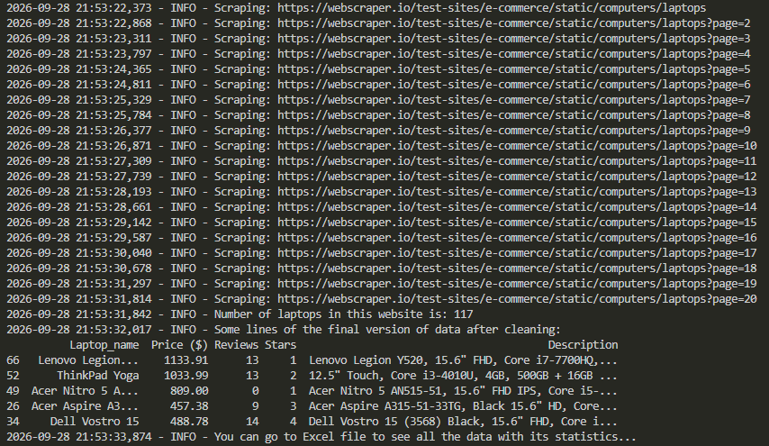

# Laptops Scraper — Web Scraping & Data Cleaning with Python
Extracts data for 117 laptops (Laptop_name, Price ($), Reviews, Stars, Description) from all [webscraper.io's laptops test page](https://webscraper.io/test-sites/e-commerce/static/computers/laptops) pages, processes it fully with pandas (cleaning and organizing), and exports it cleanly to an Excel file.



___

## ✨ Features :
- Automatically paginates through **all pages** on webscraper.io's e-commerce test site, collecting every laptop listing until the last page
- Extracts laptop name, price, review count, star rating, and full description for each product, with graceful fallbacks when a field is missing
- Cleans and standardizes the price column (removes currency symbols, converts to numeric) for accurate sorting
- Sorts laptops by price (cheapest to most expensive), then alphabetically by name
- Dual-level logging (console + file) that records every step of the scraping process, making debugging effortless
- Exports results to a multi-sheet Excel file: one sheet with the full laptops data, and a second sheet with automatic statistics (price distribution: min, max, average, etc.)
___

## ✨ Prerequisites :
- **Python 3.8+**
- **Git**
___

## ✨ Installation :
1. Clone the project :
```bash
git clone https://github.com/Zino0003/laptops-scraper.git
cd laptops-scraper
```
2. Creating the virtual environment (laptops_scraper_venv) and activate it :
```bash
python -m venv laptops_scraper_venv
```
- Activate on Windows (Git Bash) :
```bash
source laptops_scraper_venv/Scripts/activate
```
- Activate on Windows (CMD / PowerShell) :
```bash
laptops_scraper_venv\Scripts\activate
```
- Activate on macOS / Linux :
```bash
source laptops_scraper_venv/bin/activate
```
3. Install the libraries :
```bash
pip install -r requirements.txt
```
___

## ✨ Usage : 
- Run the code :
```bash
python laptops_scraper.py
```
The script will:
1. Scrape laptop data (Laptop_name, Price ($), Reviews, Stars, Description) from [webscraper.io's laptops test page](https://webscraper.io/test-sites/e-commerce/static/computers/laptops)
2. Clean and process the data using pandas
3. Export the final results to `Laptops_scraping.xlsx`

A log file (`laptops_scraper.log`) will also be created, recording the scraping process and any errors encountered.

### Sample Output (Laptops_scraping.xlsx)

| Laptop_name | Price ($) | Reviews | Stars | Description |
|---|---|---|---|---|
| Asus VivoBook X441NA-GA190 Chocolate Black | 295.99 | 14 | 3 | Asus VivoBook X441NA-GA190 Chocolate Black, 14", Celeron N3450, 4GB, 128GB SSD, Endless OS, ENG kbd |
| Prestigio SmartBook 133S Dark Grey | 299 | 8 | 2 | Prestigio SmartBook 133S Dark Grey, 13.3" FHD IPS, Celeron N3350 1.1GHz, 4GB, 32GB, Windows 10 Pro + Office 365 1 gadam |
| Prestigio SmartBook 133S Gold | 299 | 12 | 4 | Prestigio SmartBook 133S Gold, 13.3" FHD IPS, Celeron N3350 1.1GHz, 4GB, 32GB, Windows 10 Pro + Office 365 1 gadam |
___

## ✨ Project Structure :
```text
laptops-scraper/
├── laptops_scraper.py      # Main script (scraping)
├── requirements.txt        # Python dependencies
├── Laptops_scraping.xlsx   # Sample output (cleaned)
├── Attached_files/         # Output screenshots
├── LICENSE                 # License file
├── .gitignore              # Git ignore rules
└── README.md               # Project documentation
```
___


## Built With
- [Python 3.8+](https://www.python.org/) — core programming language
- [Requests](https://requests.readthedocs.io/) — for sending HTTP requests
- [BeautifulSoup4](https://www.crummy.com/software/BeautifulSoup/) — for parsing HTML and extracting data
- [lxml](https://lxml.de/) — fast HTML parser used with BeautifulSoup
- [pandas](https://pandas.pydata.org/) — for data cleaning, processing, and export
- [openpyxl](https://openpyxl.readthedocs.io/) — engine used by pandas to write Excel (.xlsx) files
- [Logging](https://docs.python.org/3/library/logging.html) — built-in module for structured event logging
___

## ✨ License :
Distributed under the MIT License. See [LICENSE](LICENSE) for more information.
___

## ✨ Contact :
**Mr. Zine elabidine ABDELOUAHAB** 
- **LinkedIn Profile:** [Click here](https://www.linkedin.com/in/zine-abdelouahab) 
- **Email:** abdelouahabzineelabidine@gmail.com

Project Link: [GitHub Repository](https://github.com/Zino0003/laptop s-scraper)

